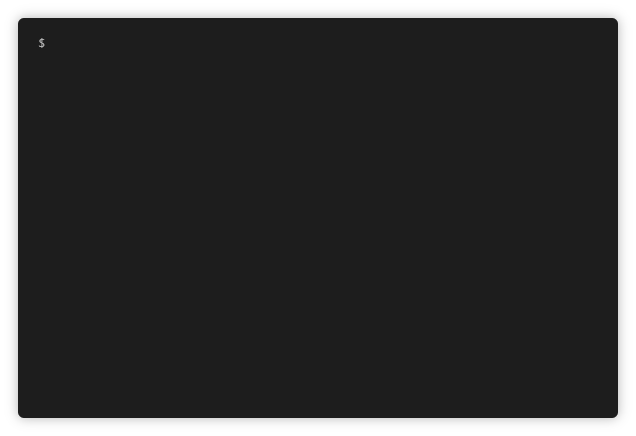

# Kimai2-cmd

Command line client for [Kimai2](https://www.kimai.org/), the open source, self-hosted time tracker.


To use this program you have to install Kimai2 first!

## Features

This client is not intended to replace the Kimai webUI, so only basic functions, starting and stopping measurements

Commands: 
- Start, restart and stop measurements
- List active and recent measurements
- List projects and activities

UI:
- Interactive terminal UI with autocomplete
- Classic terminal UI for integration 

Integration:
- Portable executable for all three platforms
- Installer for Windows
- Generate output for Rainmeter (Windows). More info here: [kimai2-cmd-rainmeter](https://github.com/infeeeee/kimai2-cmd-rainmeter)
- Generate output for Argos/Kargos/Bitbar (Gnome, Kde, Mac). More info here: [kimai2-cmd-argos](https://github.com/infeeeee/kimai2-cmd-argos)

Requests for integrations with other softwares are welcomed! Just open an issue and show an example output, what you need.

## Installation

Download from [releases](https://github.com/infeeeee/kimai2-cmd/releases/latest). 

You have to create an API password for your username on your Kimai installation. In Kimai: User menu (Top right corner) -> Edit -> API.

### Notes on Windows

Portable executable or installer available. 

Installer automatically adds the install path to the %PATH% environment variable, so you can use it from command line/powershell system wide. Sign out and in if it's not working.

With the portable version you have to do this manually. Follow [this tutorial](https://stackoverflow.com/questions/44272416/how-to-add-a-folder-to-path-environment-variable-in-windows-10-with-screensho) or a similar one if you don't know how to do it.

### Notes on Linux/Mac

Portable executable only. On the following terminal examples use the file name you downloaded. 

Make the downloaded binary executable:
```
sudo chmod +x kimai2-cmd-os
```

Add kimai2-cmd to path so you have to just type `kimai` to the terminal:
```
sudo ln -s /path/to/kimai2-cmd-os /usr/bin/kimai
```

To remove:
```
sudo rm /usr/bin/kimai
```

### Install with npm

If npm installed you can install it with the following command:

```
npm install -g infeeeee/kimai2-cmd
```

## Usage

Two usage modes: interactive and classic ui

### Interactive ui



If you start without any commands, you will get to the interactive UI. Use your keyboard's arrow keys for navigation. On the `Start new measurement` menu item you can search for project and activity names.

You can exit with ctrl+c any time.

### Classic ui

You can find all the options in the help:

```
$ kimai2-cmd --help

Usage: kimai2-cmd [options] [command]

Command line client for Kimai2. For interactive mode start without any commands. To generate settings file start in interactive mode!

Options:
  -V, --version               output the version number
  -v, --verbose               verbose, longer logging
  -i, --id                    show id of elements when listing
  -b, --argosbutton           argos/bitbar button output
  -a, --argos                 argos/bitbar output
  -h, --help                  output usage information

Commands:
  start [project] [activity]  start selected project and activity
  restart [id]                restart selected measurement
  stop [id] [description]     stop all or selected measurement measurements, [id] is optional, [description] is optional but needs [id]
  rainmeter                   update rainmeter skin
  list-active                 list active measurements
  list-recent                 list recent measurements
  list-projects               list all projects
  list-activities             list all activities
  url                         prints the url of the server
```

Project and activity names are case insensitive. If your project or activity name contains a space, wrap it in double or single quotes. This example starts project named `foo` with activity named `bar bar`:

```
kimai2-cmd start "foo" "bar bar"
```

### Settings and first run

All settings stored in the settings.ini file. Place this file to the same directory as the executable. If no settings file found you will drop to the interactive UI, where you can add your settings:


You can create your settings.ini file manually, by downloading, renaming and editing [settings.ini.example](https://github.com/infeeeee/kimai2-cmd/blob/master/settings.ini.example).

On the windows installer version settings.ini location: `C:\Users\Username\AppData\Roaming\kimai2-cmd\settings.ini`

You can also store the settings.ini file in custom location, just export the full path to the `KIMAI_CONFIG` variable, something like this:

```bash
export KIMAI_CONFIG=$XDG_CONFIG_HOME/kimai2/settings.ini
```

Integration settings are not asked during first run, you have to change them manually in settings.ini. If you don't use an integration, you can safely ignore it's settings.

## Development version

### Installation

Prerequisites:
- node js 10+
- git

```
git clone https://github.com/infeeeee/kimai2-cmd
cd kimai2-cmd
npm i
```

### Build

Prerequisite: globally installed [pkg](https://github.com/zeit/pkg): 

```
npm i pkg -g
```

Build for current platform and architecture

```
npm run build-current
```

Build x64 executables for linux, mac on linux or on mac

```
npm run build-nix
```

About building for other platforms see pkg's documentation, or open an issue and I can build it for you.

### Installer (Windows only)

Prerequisite: [Inno Setup](http://www.jrsoftware.org/isinfo.php)

- Create a windows build: `npm run build-current`
- Open `kimai2-innosetup.iss` in Inno Setup

### Usage

For interactive mode just simply:

```
npm start
```

For usage with options you have pass a `--` before the options. You don't need this if you don't use options just commands:

```
npm start -- -V
npm start start foo bar
```

On the first run it will ask for your settings, but you can just copy settings.ini.example to settings.ini and modify it with your favorite text editor

## Troubleshooting

If you find a bug open an issue here! 

## License

MIT